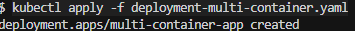

# Домашнее задание: Сетевое взаимодействие в Kubernetes

## Выполненные задачи

### Задача 1: Настройка Service (ClusterIP и NodePort)

#### 1. Создание Deployment с двумя контейнерами
**Манифест:** `deployment-multi-container.yaml`

```yaml
apiVersion: apps/v1
kind: Deployment
metadata:
  name: multi-container-app
spec:
  replicas: 3
  selector:
    matchLabels:
      app: multi-container-app
  template:
    metadata:
      labels:
        app: multi-container-app
    spec:
      containers:
      - name: nginx
        image: bitnami/nginx
        ports:
        - containerPort: 8080
        env:
        - name: NGINX_HTTP_PORT_NUMBER
          value: "8080"
      - name: multitool
        image: wbitt/network-multitool
        ports:
        - containerPort: 8081
        env:
        - name: HTTP_PORT
          value: "8081"
```

**Скриншот 1:** 


#### 2. Создание ClusterIP Service
**Манифест:** `service-clusterip.yaml`

```yaml
apiVersion: v1
kind: Service
metadata:
  name: multi-container-service
spec:
  type: ClusterIP
  selector:
    app: multi-container-app
  ports:
  - name: nginx
    port: 9001
    targetPort: 8080
    protocol: TCP
  - name: multitool
    port: 9002
    targetPort: 8081
    protocol: TCP
```

**Скриншот 2:** 


#### 3. Тестирование ClusterIP Service


#### 4. Создание NodePort Service
**Манифест:** `service-nodeport.yaml`

```yaml
apiVersion: v1
kind: Service
metadata:
  name: nginx-nodeport
spec:
  type: NodePort
  selector:
    app: multi-container-app
  ports:
  - name: nginx
    port: 80
    targetPort: 8080
    protocol: TCP
    nodePort: 30080
```


 (проверка статуса NodePort сервиса)

Я попытался сделать port-forward для доступа к nodeport и вылетела ошибка, но доступ появился, видимо это связано с WSL винды, то есть на самом нем есть возможность nodeport порт увидеть, а винда не может, команда уходит, но ответ для винды некорректны, но все работает


### Задача 2: Настройка Ingress

#### 1. Создание frontend Deployment
**Манифест:** `deployment-frontend.yaml`

```yaml
apiVersion: apps/v1
kind: Deployment
metadata:
  name: frontend
spec:
  replicas: 1
  selector:
    matchLabels:
      app: frontend
  template:
    metadata:
      labels:
        app: frontend
    spec:
      containers:
      - name: nginx
        image: bitnami/nginx
        ports:
        - containerPort: 8080
        env:
        - name: NGINX_HTTP_PORT_NUMBER
          value: "8080"
```


#### 2. Создание backend Deployment
**Манифест:** `deployment-backend.yaml`

```yaml
apiVersion: apps/v1
kind: Deployment
metadata:
  name: backend
spec:
  replicas: 1
  selector:
    matchLabels:
      app: backend
  template:
    metadata:
      labels:
        app: backend
    spec:
      containers:
      - name: multitool
        image: wbitt/network-multitool
        ports:
        - containerPort: 8080
        env:
        - name: HTTP_PORT
          value: "8080"
```


#### 3. Создание Services
**Манифесты:** `service-frontend.yaml`, `service-backend.yaml`

**Скриншот 11:** `kubectl apply -f service-frontend.yaml`
**Скриншот 12:** `kubectl apply -f service-backend.yaml`


#### 4. Установка Ingress-контроллера
**Скриншот 13:** `kubectl apply -f https://raw.githubusercontent.com/kubernetes/ingress-nginx/controller-v1.10.0/deploy/static/provider/cloud/deploy.yaml`


#### 5. Создание Ingress
**Манифест:** `ingress.yaml`

```yaml
apiVersion: networking.k8s.io/v1
kind: Ingress
metadata:
  name: app-ingress
  annotations:
    nginx.ingress.kubernetes.io/rewrite-target: /
spec:
  ingressClassName: nginx
  rules:
  - http:
      paths:
      - path: /
        pathType: Prefix
        backend:
          service:
            name: frontend-service
            port:
              number: 80
      - path: /api
        pathType: Prefix
        backend:
          service:
            name: backend-service
            port:
              number: 80
```

**Скриншот 14:** `kubectl apply -f ingress.yaml`


#### 6. Тестирование Ingress

**Скриншот 16:** `curl http://localhost:8080/` (frontend)


**Скриншот 17:** `curl http://localhost:8080/api` (backend)


